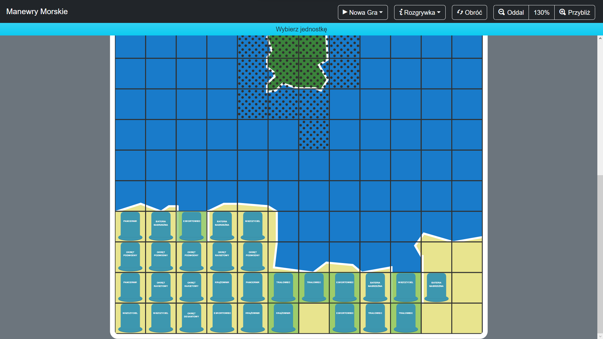
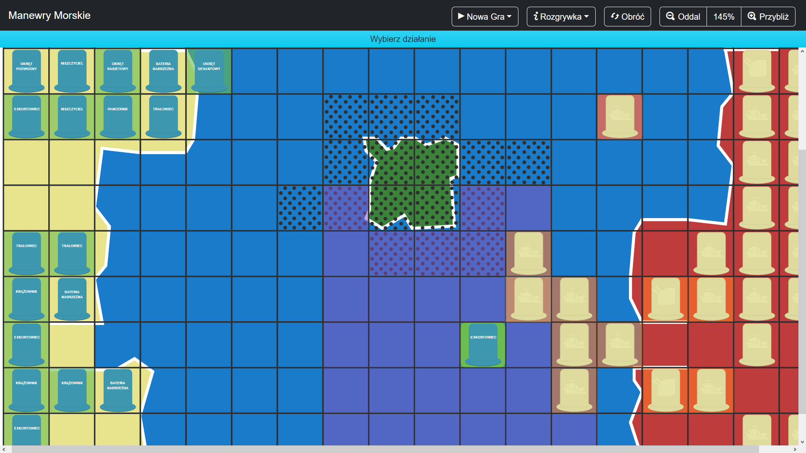
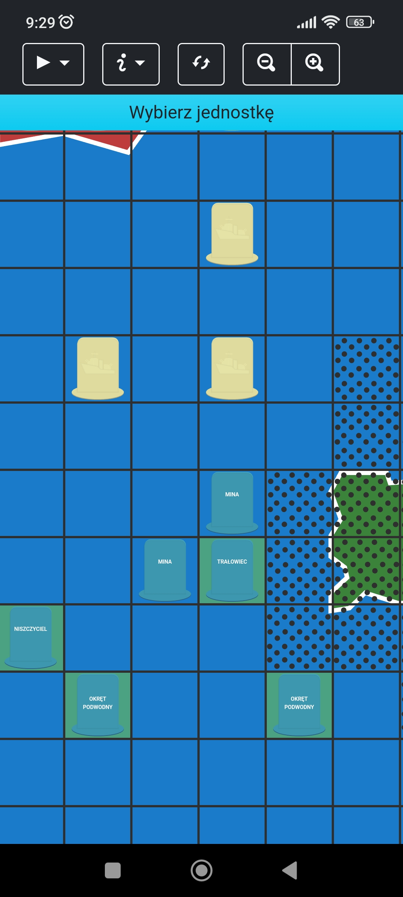

# Manewry Morskie

Gra planszowa [*Manewry Morskie*](http://www.nostalgia.pl/manewry-morskie) odtworzona w formie aplikacji webowej oraz aplkacji multiplatformowej na systemy Android i Windows umożliwająca rozgrywkę online lub w trybie "Hot Seat".
Rozwiązanie zaimplementowane przy pomocy technologii Blazor, ASP .NET Core, SignalR oraz MAUI Blazor Hybrid ze środowiska .NET

## Architektura

## Zrzuty ekranu

